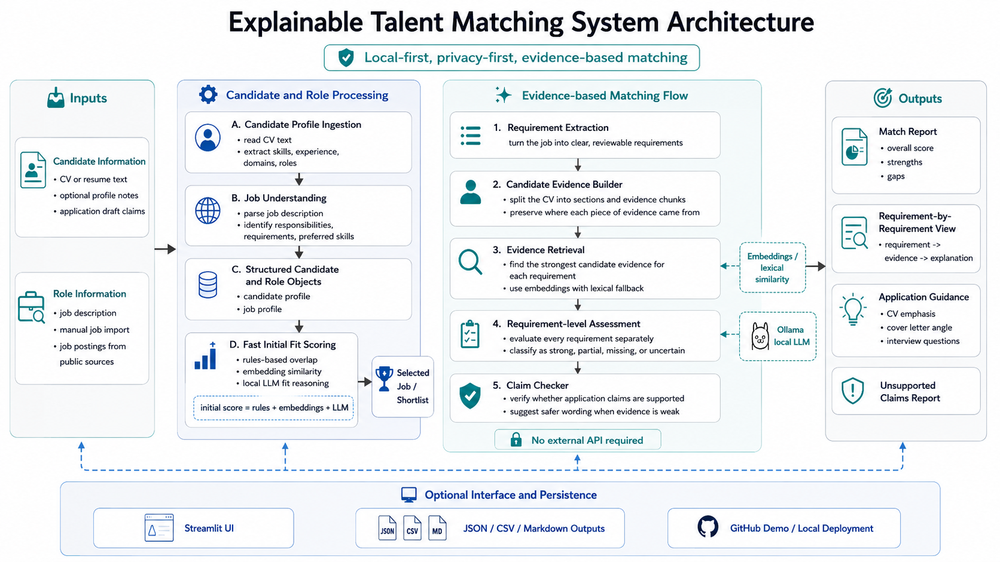

# job_searcher_ai

`job_searcher_ai` is a command-line job discovery and ranking assistant built for personal job hunting. It ingests a long-form profile, extracts structured strengths, generates search queries, pulls public jobs from supported sources, scores them with interpretable rules plus optional local AI, and produces reviewable outputs.

The v1 design is intentionally local-first:

- Uses Ollama by default for local LLM reasoning.
- Works without paid APIs.
- Stores intermediate JSON so every stage is inspectable.
- Avoids auto-apply behavior.
- Respects public-source boundaries and does not attempt login bypass or anti-bot evasion.

## Architecture



The system separates profile ingestion, source discovery, matching, local explanation, and reviewable exports so each stage can be inspected independently.

Explainable matching follows this workflow:

1. Ingest a candidate profile into the existing `UserProfile` model.
2. Parse one selected role into the existing `JobListing` model.
3. Extract concise job requirements, retrieve profile evidence for each requirement, and assess direct or transferable support.
4. Optionally check proposed application claims against the same evidence.
5. Export JSON and Markdown reports that remain reviewable without any remote service.

Install all local development, embedding, and UI extras:

```powershell
pip install -e .[dev,embeddings,ui]
```

Run an explainable match from the CLI, replacing the job path with the selected role file:

```powershell
C:\Users\afaqs\anaconda3\python.exe -m job_searcher explain-match `
  --profile data/profile_master.md `
  --job examples/ai_job.txt
```

The repository also includes fictional sample inputs:

```powershell
C:\Users\afaqs\anaconda3\python.exe -m job_searcher explain-match `
  --profile examples/sample_candidate_profile.md `
  --job examples/sample_job_description.txt `
  --claims examples/sample_claims.txt
```

Launch the Streamlit interface:

```powershell
streamlit run app.py
```

The output includes an overall fit score, an advisory recommendation, strengths, gaps, requirement-level assessments, evidence excerpts, and unsupported application-claim checks.

## Features

- Profile ingestion from Markdown and text files
- Deterministic skill, domain, role, and industry extraction
- Optional Ollama-based summarization and fit explanations
- Search query generation with adjacent-role expansion
- Public source connectors for Greenhouse, Lever, RSS, static pages, custom career pages, and manual imports
- Hybrid ranking with symbolic scoring, optional embeddings, and qualitative reasoning
- CSV, JSON, and Markdown outputs
- Cache layer for repeated fetches

## Repository layout

```text
job_searcher_ai/
  config/
  data/
  docs/
  outputs/
  scripts/
  src/job_searcher/
  tests/
```

## Setup

1. Create and activate a Python 3.11+ environment.
2. Install the package in editable mode.

```powershell
cd d:\Autojobapply\job_searcher_ai
C:\Users\afaqs\anaconda3\python.exe -m pip install -e .[dev]
```

Optional extras:

- Embeddings: `C:\Users\afaqs\anaconda3\python.exe -m pip install -e .[dev,embeddings]`
- Streamlit UI experiments: `C:\Users\afaqs\anaconda3\python.exe -m pip install -e .[ui]`
- Browser automation for future dynamic pages: `C:\Users\afaqs\anaconda3\python.exe -m pip install -e .[browser]`
- After installing the browser extra, install Chromium once: `C:\Users\afaqs\anaconda3\python.exe -m playwright install chromium`

## Ollama

Install Ollama from the official project site, then pull a local model:

```powershell
ollama pull llama3.1:8b
ollama pull mistral:7b
ollama pull qwen2.5:7b
```

Default config points at:

- Host: `http://localhost:11434`
- Model: `llama3.1:8b`

You can change both in `config/settings.yaml` or by environment variable.

## Inputs

- Main profile: `data/profile_master.md`
- Optional additional resume files: Markdown or text
- Optional preferences in `config/settings.yaml`
- Optional manual job imports: JSON or CSV files

## Commands

After installation, either use `python -m job_searcher ...` or the `job-searcher` entrypoint.

### Ingest profile

```powershell
C:\Users\afaqs\anaconda3\python.exe -m job_searcher ingest-profile --input data/profile_master.md
```

### Generate search queries

```powershell
C:\Users\afaqs\anaconda3\python.exe -m job_searcher generate-queries
```

### Search jobs

```powershell
C:\Users\afaqs\anaconda3\python.exe -m job_searcher search-jobs
```

### Rank jobs

```powershell
C:\Users\afaqs\anaconda3\python.exe -m job_searcher rank-jobs
```

### Build reports

```powershell
C:\Users\afaqs\anaconda3\python.exe -m job_searcher report
```

### Run the whole pipeline

```powershell
C:\Users\afaqs\anaconda3\python.exe -m job_searcher run-all --input data/profile_master.md
```

## Outputs

The pipeline writes:

- `outputs/profile_document.json`
- `outputs/profile_structured.json`
- `outputs/profile_keywords.json`
- `outputs/profile_keywords.md`
- `outputs/search_queries.json`
- `outputs/discovered_jobs.json`
- `outputs/filtered_jobs_debug.json`
- `outputs/custom_career_pages_debug.json`
- `outputs/custom_career_page_filters.json`
- `outputs/site_filtered_jobs.json`
- `outputs/site_filtered_jobs.md`
- `outputs/jobs_ranked.json`
- `outputs/jobs_ranked.csv`
- `outputs/top_matches.md`
- `outputs/search_report.md`
- `outputs/explainable_match_report.json`
- `outputs/explainable_match_report.md`

Each ranked result includes:

- Overall score
- Interpretable subscores
- Why it matches
- Missing skills
- Resume emphasis angle
- Cover-letter angle
- `apply`, `maybe`, or `skip` label

## Explainable Matching Outputs

The explainable match report is candidate-to-role, not a bulk ranking. It includes:

- Overall fit score from requirement-level statuses, separate from the existing ranking score
- Requirement-level evidence with source labels and similarity scores
- Direct versus transferable experience explanations
- Missing or uncertain requirements for human review
- Unsupported application claim detection
- Safer wording suggestions when a claim is exaggerated or not directly supported

## Supported job sources

- Greenhouse board API
- Lever postings API
- RSS feeds
- Static company pages with configurable selectors
- Custom career pages with same-domain crawling and sitemap fallback
- Manual imports from local JSON and CSV

The connectors are pluggable and can be extended without touching the ranking pipeline.

## Custom career pages

Enable the source in `config/settings.yaml` and add one or more entries under `sources.custom_career_pages`.

```yaml
sources:
  toggles:
    custom_career_pages: true
  custom_career_pages:
    - name: KUKA Vacancies
      company: KUKA
      url: https://www.kuka.com/en-de/company/careers/vacancies
      include_url_patterns:
        - /company/careers/
        - /vacancies/
      max_pages: 200
```

The connector saves everything it discovered to `outputs/custom_career_pages_debug.json`, so you can inspect the parsed jobs before relying on ranking. Any discovered roles that also match your generated queries automatically flow into `outputs/discovered_jobs.json`, `outputs/jobs_ranked.json`, and `outputs/jobs_ranked.csv`.

For JavaScript-rendered listings such as KUKA, enable browser rendering on that page config:

```yaml
sources:
  toggles:
    custom_career_pages: true
  custom_career_pages:
    - name: KUKA Careers DE
      company: KUKA
      url: https://www.kuka.com/de-de/unternehmen/karriere
      include_url_patterns:
        - /stellenangebote/
      render_javascript: true
      rendered_link_selector: a.m-results__anchor
      rendered_wait_selector: a.m-results__anchor
      max_pages: 200
```

This requires the optional browser extra plus `playwright install chromium`. The crawler will first try normal HTML and sitemap discovery, then fall back to a rendered DOM scrape when `render_javascript` is enabled.

When rendered pages expose built-in filters, the source now captures them into `outputs/custom_career_page_filters.json`. Each snapshot includes detected filter field labels, inferred semantic kinds such as `country_region`, `company`, `category`, and `search_text`, plus the available options seen in the DOM. When `apply_site_filters: true` is set for a page, the source also derives a small set of generic filter plans from your config and generated queries and tries them in the rendered page before collecting result links.
The system also writes the extracted profile keyword pack to `outputs/profile_keywords.json` and `outputs/profile_keywords.md`, plus all jobs found through site-native filtering to `outputs/site_filtered_jobs.json` and `outputs/site_filtered_jobs.md`. This keeps the LLM-informed keyword set and the site-filter matches both reviewable and reusable for later automation.


Example for a site with a built-in search and filter system:

```yaml
sources:
  custom_career_pages:
    - name: Fraunhofer Jobs EN
      company: Fraunhofer
      url: https://jobs.fraunhofer.de/search/?locale=en_US
      include_url_patterns:
        - /job/
      render_javascript: true
      apply_site_filters: true
      rendered_link_selector: a[href*="/job/"]
      rendered_wait_selector: a[href*="/job/"]
      max_pages: 200
```

This lets the generic source inspect fields like `Search by Keyword`, `Region`, `Institute`, and similar controls, derive filter plans such as `country_region=Germany` plus relevant search terms, and then collect result URLs from the filtered result set.

## Limitations

- Source coverage depends on configured boards, feeds, and manual inputs.
- Generic static-page parsing is best-effort and may need page-specific selectors or URL patterns.
- Some career pages render jobs client-side and may require sitemap discovery, direct job-detail URLs, or a future page-specific connector.
- Ollama reasoning degrades gracefully when a local model is unavailable, but explanations become heuristic.
- Embedding similarity is optional and requires a local sentence-transformers install.
- v1 does not auto-submit applications.

## Testing

```powershell
C:\Users\afaqs\anaconda3\python.exe -m pytest
```

## Extension ideas

- Streamlit review UI
- More source connectors and company-board discovery helpers
- Duplicate job clustering across sources
- Email digests
- Tailored resume bullet exports
- Human-in-the-loop application material drafting
